# 👋 Hey, I'm Henry Elliott

### Cybersecurity • Developer • Crypto & Web3

I build tools that solve real problems, spanning cybersecurity, software development, automation, and blockchain technology.

---

## 🤓 Stats For Nerds





---

## 💻 About Me

```python
from github import Readme


class Henry(Readme):
    def __init__(self):
        self.name = "Henry Elliott"
        self.github = "@HenryElliott"
        self.interests = [
            "Cybersecurity",
            "Software Development",
            "Automation",
            "Blockchain",
            "Solana",
            "Web3",
        ]

    def currently_building(self):
        return "Something interesting..."
```

---

## 🛠️ Languages & Tools


---

## 🔐 Cybersecurity Focus

```text
> Security Research
> OSINT
> Networking
> Privacy & OPSEC
> Python-based Automation
```

---

## ⛓️ Web3 Focus

```text
> Solana Development
> On-Chain Analytics
> Trading Tools
> Crypto APIs
```

---

## 📊 Activity


### 🐍 Contribution Snake

<picture>
  <source
    media="(prefers-color-scheme: dark)"
    srcset="https://raw.githubusercontent.com/HenryElliott/HenryElliott/output/github-snake-dark.svg"
  />
  <source
    media="(prefers-color-scheme: light)"
    srcset="https://raw.githubusercontent.com/HenryElliott/HenryElliott/output/github-snake.svg"
  />
  
</picture>

---

### 🕷️ Build. Break. Learn. Repeat.
